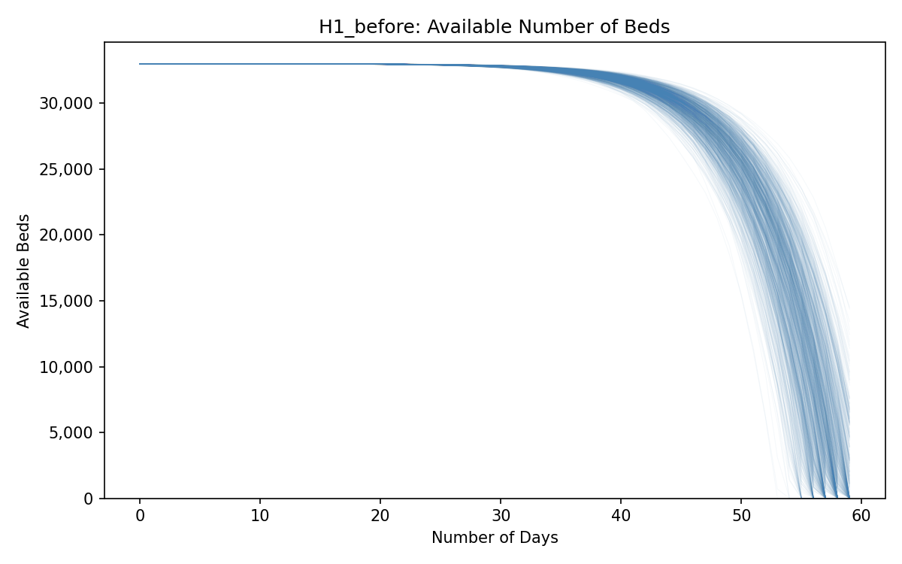
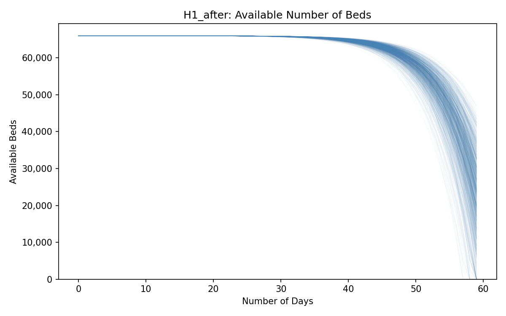
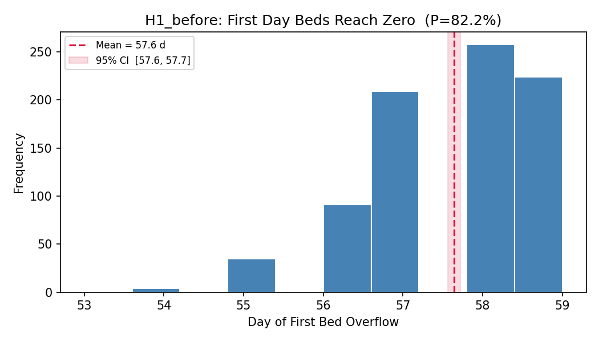
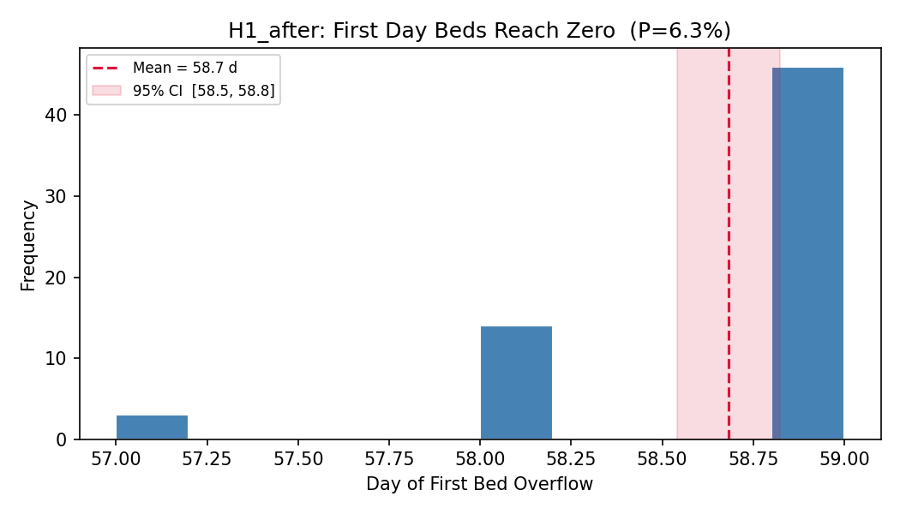
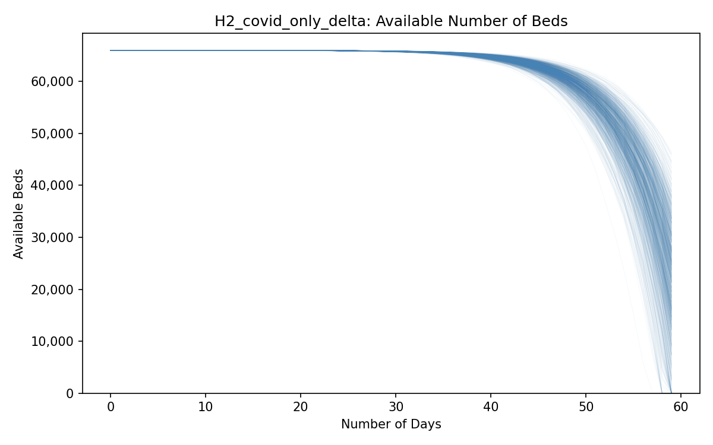
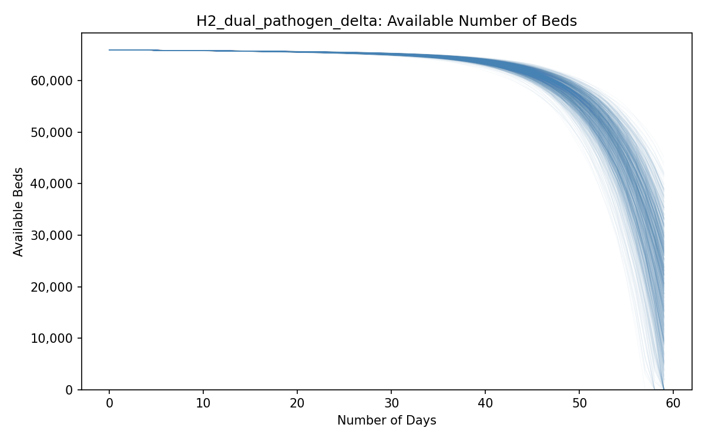
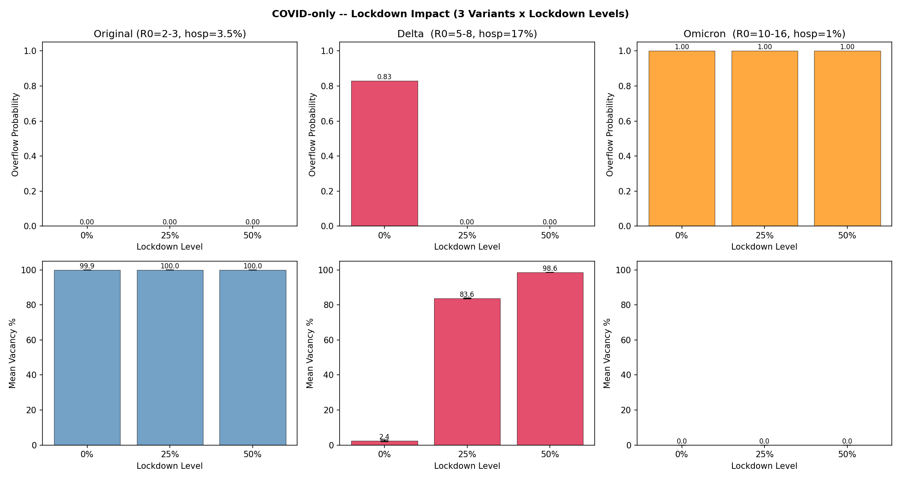
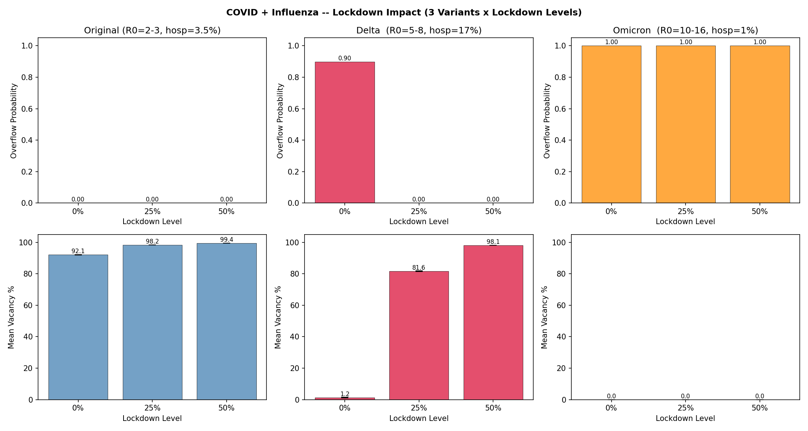
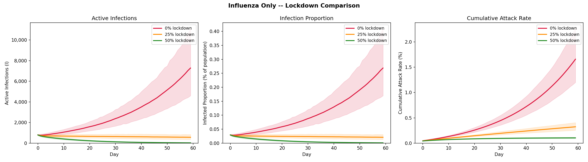
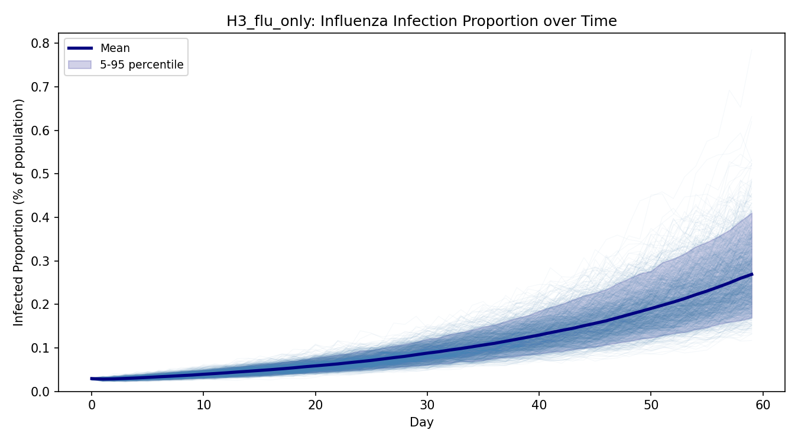

# Monte Carlo Simulation of Hospital Bed Capacity Under Surge Conditions

**Author:** Xujun Zhou  
**Course:** IS597PR
**Project Type:** Type I

---

## Abstract

This project is based on a Monte Carlo simulation study conducted as part of a 2020 course (Sanvaliya, Gupta, and Deshpande). That study utilized the SEIR model framework to simulate hospital bed overload in Chicago due to COVID-19. The original code contained structural errors. This project corrects these errors and calibrates the infection parameters for several different variants based on real-world data. Additionally, influenza is introduced as a confounding factor, and 1,000 Monte Carlo simulations are performed for each scenario.

---

## 1. Background and Motivation

Sanvaliya et al. (2020) examined whether doubling the number of available hospital beds in the Chicago area (population 2.71 million; approximately 33,000 acute care beds) during a surge in COVID-19 cases would completely eliminate bed shortages. Their main conclusion was that doubling the number of beds could *completely eliminate* patient overflow.

A review of the original code indicates that this conclusion was a spurious result caused by a bug, rather than a true characteristic of the pandemic dynamics. My revised model yields entirely different results.

---

## 2. Identified Errors in the Original Code

### 2.1 Static Susceptible Compartment

The most consequential bug appears in the SEIR update loop (`PR_final_project_oringin.py`, line 247):

```python
susceptible = susceptible - int(Variables.s_e()) * infected * susceptible
```

`Variables.s_e()` returns a transmission rate β in the range [0.07, 0.125]. Applying `int()` truncates this value to **zero on every call**, so `new_exposed` is always zero and the susceptible pool never depletes. As a result, the number of patients in the model remains constant throughout the simulation. Under these conditions, regardless of the basic reproduction number (R₀), the outbreak will not accelerate.

### 2.2 Missing Population Denominator

Exposed (E) was re-drawn as an independent random variable mid-loop, meaning S + E + I + R ≠ N. People were being created and destroyed at every timestep. The original code does not enforce population conservation, and the exposed compartment is not updated as a function of the current susceptible and infected counts. This violates the core principle of compartmental models that the total population is fixed and that transitions between compartments are governed by rates.

---

## 3. Corrected Model

### 3.1 SEIR Dynamics

The corrected SEIR model is implemented in `utilities/seir.py`. The susceptible population is updated according to the standard formula:

```python
new_exposed = int(β * infected * susceptible / population)
susceptible -= new_exposed
exposed += new_exposed - int(σ * exposed)
infected += int(σ * exposed) - int(γ * infected)
recovered += int(γ * infected)
```

### 3.2 Variant Classes

Four pathogen variants are implemented in `utilities/variants.py`:

| Variant | R₀ range | Hospitalization rate | Source calibration |
|---|---|---|---|
| Original (Wuhan) | 2–3 | 3.5% | WHO / CDC early estimates |
| Delta | 5–8 | 17% | Samieefar et al. (2022) |
| Omicron (BA.1/BA.2) | 10–16 | 1% | WHO TAG-VE (Jan 2022)|
| Influenza (seasonal) | 1.2–1.4 | 1.5% | CDC FluView (seasonal) |

### 3.3 Dual-Pathogen Extension

`dual_model` (`utilities/seir.py`) runs independent SEIR streams for COVID-19 and influenza against the same population and sums their daily hospitalization loads before passing the combined count to the bed-tracking module.

---

## 4. Hypotheses and Results

### 4.1 H1 — Does Doubling Beds Eliminate COVID-Only Overflow?

**Hypothesis:** Doubling the bed count from 33,000 to 66,000 eliminates overflow under a Delta-variant COVID-only surge.

| Scenario | Beds | Overflow Probability | Mean Overflow Day | 95% CI | Mean Vacancy % | 95% CI |
|---|---:|---:|---:|---:|---:|---:|
| Baseline | 33,000 | **82.2%** | 57.6 | [57.6, 57.7] | 2.62% | [2.19%, 3.04%] |
| Doubled  | 66,000 | **6.3%**  | 58.7 | [58.5, 58.8] | 35.12% | [34.07%, 36.17%] |

**Finding:** Although increasing the number of hospital beds reduced the probability of overflow from 82.2% to 6.3%, it did not completely eliminate the risk.

| Baseline | Doubled |
|---|---|
|  |  |
|  |  |

---

### 4.2 H2 — Does Influenza Co-Circulation Negate the Benefit of Doubled Beds?

**Hypothesis:** Adding seasonal influenza to a doubled-bed scenario restores meaningful overflow risk, demonstrating that bed expansion alone is an insufficient policy lever.

Both scenarios use 66,000 beds (doubled), Delta variant, no lockdown.

| Scenario | Overflow Probability | Mean Overflow Day | 95% CI | Mean Vacancy % | 95% CI |
|---|---:|---:|---:|---:|---:|
| COVID-only | 6.6% | 58.7 | [58.6, 58.8] | 33.61% | [32.56%, 34.65%] |
| COVID + Influenza | **7.3%** | 58.8 | [58.6, 58.9] | 30.55% | [29.53%, 31.57%] |

**Finding:** Influenza co-circulation raises overflow probability by roughly 11% relative (6.6% → 7.3%) and reduces mean bed vacancy from 33.6% to 30.6%, confirming that dual-pathogen increases system stress even when beds have been doubled.

| COVID-only (doubled beds) | COVID + Influenza (doubled beds) |
|---|---|
|  |  |

---

### 4.3 H3 — Do Lockdowns Mitigate Overflow, and Does Variant Matter?

**Hypothesis:** A 25–50% behavioral compliance lockdown reduces overflow probability, but the degree of benefit is strongly modulated by variant transmissibility.

Scenarios are run at baseline beds (33,000) across three lockdown levels and three COVID variants, both with and without concurrent influenza. Full tables are in `simulation_summary.md`; key results are highlighted below.

#### COVID-only overflow probability by variant and lockdown

| Variant | 0% lockdown | 25% lockdown | 50% lockdown |
|---|---|---|---|
| Original | 0.0% | 0.0% | 0.0% |
| Delta | **82.9%** | **0.0%** | 0.0% |
| Omicron | **100.0%** | **100.0%** | **100.0%** |

**Finding:** Lockdown is highly effective for Delta (82.9% → 0% with only 25% compliance) but completely ineffective for Omicron (100% overflow at all levels). The original strain poses negligible bed demand in this parameter range. Adding influenza modestly increases original and Delta overflow.





#### Influenza-only infection dynamics across lockdown levels

Influenza alone does not overflow the bed system at any lockdown level. Lockdown substantially compresses both peak infection count and attack rate. This is generally consistent with the decline in influenza cases during the COVID-19 pandemic described in Peek (2021).





---

## 5. Getting Started

### 5.1 Repository Layout

```
.
├── main.py                        # CLI entry point
├── scripts/
│   ├── h1_bed_doubling.py         # H1 experiment driver
│   ├── h2_dual_pathogen.py        # H2 experiment driver
│   └── h3_lockdown_experiment.py  # H3 experiment driver
├── utilities/
│   ├── seir.py                    # Corrected SEIR engine
│   ├── variants.py                # Variant and flu parameter classes
│   ├── bed_tracking.py            # Admission / discharge accounting
│   ├── distributions.py           # PERT distribution
│   ├── plotting.py                # All figure generation
│   ├── stats.py                   # 95% CI and summary statistics
│   └── reporting.py               # Markdown summary writer
├── 2020/                          # Original code, preserved unchanged
├── test_images/                   # Output plots (generated on run)
└── simulation_summary.md          # Numeric results (generated on run)
```

### 5.2 Running the Full Simulation

```bash
python main.py
```

This runs all three hypotheses with the defaults: 2,710,000 population, 33,000 beds, 200 simulations, 60 days, multiprocessing enabled.

To increase statistical precision (1,000 simulations matches the published results above):

```bash
python main.py --sims 1000
```

Full CLI reference:

```
usage: main.py [-h] [--hypothesis {h1,h2,h3,all}]
               [--population POPULATION] [--beds BEDS]
               [--sims SIMS] [--days DAYS]
```
---

## 6. Statement
The SEIR model structure and Monte Carlo framework in this project are based on the original code by Sanvaliya et al. (2020), but have been refactored and all identified errors have been corrected. The code for generating test images in this project was written with the assistance of Claude. Some sections of this README were translated with the help of DeepL.

## 7. References

Sanvaliya, R., Gupta, T., & Deshpande, V. (2020). *Monte Carlo Simulation on Hospital Capacity during COVID-19*. IS590PR Final Project, University of Illinois Urbana-Champaign. [GitHub](https://github.com/tanyagupta55/final_project_2020Sp)

Samieefar, N., Rashedi, R., Akhlaghdoust, M., Mashhadi, M., Darzi, P., & Rezaei, N. (2022). Delta Variant: The New Challenge of COVID-19 Pandemic, an Overview of Epidemiological, Clinical, and Immune Characteristics. Acta bio-medica : Atenei Parmensis, 93(1), e2022179. https://doi.org/10.23750/abm.v93i1.12210

Buchsbaum, P. (2012). Modified PERT Simulation. *Proceedings of the 2012 Winter Simulation Conference*.

Centers for Disease Control and Prevention. COVID-NET: COVID-19-Associated Hospitalization Surveillance Network. https://gis.cdc.gov/grasp/covidnet/COVID19_3.html

Centers for Disease Control and Prevention. FluView Interactive. https://www.cdc.gov/flu/weekly/fluviewinteractive.htm

World Health Organization. (2022). *Tracking SARS-CoV-2 variants*. https://www.who.int/en/activities/tracking-SARS-CoV-2-variants/
